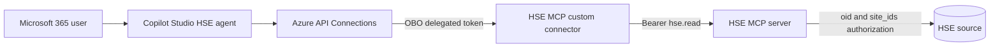

# Copilot Studio custom connector with OBO OAuth

This path attaches the HSE MCP server to a specific Copilot Studio agent through a Power Platform custom connector. The connector preserves the signed-in user's identity and obtains a delegated HSE API token through on-behalf-of authentication.

## Included artifacts

- `integrations/custom-connector/hse-mcp.swagger.template.yaml`: Streamable HTTP MCP definition for portal import.
- `integrations/custom-connector/hse-mcp.swagger.template.json`: Equivalent definition for PAC CLI import.
- `scripts/build-custom-connector.ps1`: Generates the importable Swagger from `.env`.
- `scripts/provision-obo-connector-app.ps1`: Creates or updates the separate connector app registration, adds delegated `hse.read`, exposes `access_as_user`, and preauthorizes Azure API Connections.

## Build and configure

1. Set `HSE_ENTRA_TENANT_ID`, `HSE_ENTRA_AUDIENCE`, `HSE_ENTRA_RESOURCE_URL`, and `HSE_OBO_CONNECTOR_APP_DISPLAY_NAME` in `.env`.
2. Run `scripts/provision-obo-connector-app.ps1` as a tenant administrator. It creates the application service principals, grants tenant admin consent for delegated `hse.read`, and verifies the OAuth grant. Store its printed client ID as `HSE_OBO_CONNECTOR_CLIENT_ID` in `.env`.
3. Run `scripts/build-custom-connector.ps1`. Import `integrations/custom-connector/hse-mcp.generated.yaml` in Power Apps **Custom connectors**, or use the generated JSON definition and API properties with `pac connector create`.
4. On the connector **Security** tab choose Microsoft Entra ID OAuth, set **Client ID** from `HSE_OBO_CONNECTOR_CLIENT_ID`, **Tenant ID** from `HSE_ENTRA_TENANT_ID`, **Resource URL** to `api://<HSE_ENTRA_AUDIENCE>`, **Scope** to `api://<HSE_ENTRA_AUDIENCE>/hse.read`, and enable **on-behalf-of login**.
5. Use a confidential client secret held only in the Power Platform connector, or select the managed-identity option when enabled in the tenant. For managed identity, save the connector, copy its issuer and subject into `HSE_OBO_MANAGED_IDENTITY_ISSUER` and `HSE_OBO_MANAGED_IDENTITY_SUBJECT`, then rerun the provisioning script to create the federated credential.
6. Copy the connector-generated redirect URI into `HSE_OBO_REDIRECT_URI`, rerun the provisioning script, delete stale connector connections, and create a new user connection.
7. Add the MCP operation to the HSE agent, enable generative orchestration, publish, and share both the agent and connector. End users need **Can view** on the connector and an environment role that can read connectors.

## Identity contract

The connector app is a client, not the HSE resource API. The resulting access token must have the HSE app as audience, `hse.read` in `scp`, the user in `oid`, and the authorized sites as Entra app roles in the claim named by `HSE_ENTRA_SITE_CLAIM`. Connector-facing tools derive site scope exclusively from that claim.

Test `initialize`, `tools/list`, and `tools/call` from the custom connector test tab. The operation is `InvokeHseMcp`; the JSON-RPC method remains an MCP method.

If Copilot reports that connector discovery failed, inspect the `tools/list` response before troubleshooting retrieval. Copilot Studio doesn't support tool input schemas whose `type` is an array of multiple types. The connector-facing functions intentionally use empty-string and zero defaults so optional inputs remain single-type JSON Schema properties. Redeploy the MCP server, delete stale connector connections, create a new connection, and re-add the MCP tool to the agent after changing a published tool schema.

Microsoft reference: [Configure OBO authentication for custom connectors](https://learn.microsoft.com/microsoft-copilot-studio/advanced-custom-connector-on-behalf-of).