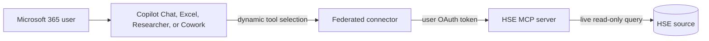

# Microsoft 365 Copilot federated connector

This path exposes the read-only HSE MCP retrieval surface directly as a tenant-local Microsoft 365 federated Copilot connector. It is independent of the Copilot Studio agent.

## Runtime implementation

The deployed `oge_hse_mcp.connector_server` is the federated runtime. It exposes only `search_hse_knowledge`, `search_procedures`, `get_procedure`, and `search_incidents`. It validates delegated Entra tokens and derives site access from Entra app roles in `HSE_ENTRA_SITE_CLAIM`. `search_hse_knowledge` returns title, content, record type, revision, and a canonical URL rooted at `HSE_SOURCE_ITEM_BASE_URL` for grounding and citations.

The static expected contract is in `integrations/federated-connector/tool-contract.json`. Run `scripts/validate-federated-connector.ps1` to verify OAuth protected-resource metadata and anonymous denial against `HSE_ENTRA_RESOURCE_URL`.

## Create and enable the tenant-local connector

Custom federated connectors for proprietary organizational data can be created directly in the tenant without publication as a global gallery connector.

1. Set `HSE_FEDERATED_CONNECTOR_NAME`, `HSE_ENTRA_RESOURCE_URL`, `HSE_ENTRA_AUDIENCE`, and `HSE_SOURCE_ITEM_BASE_URL` in `.env`.
2. Validate the endpoint and contract with `scripts/validate-federated-connector.ps1`.
3. In Teams Developer Portal, open **Tools > Microsoft Entra SSO client ID registration** and create a registration with the MCP base URL, HSE resource app client ID, and delegated `hse.read` scope.
4. Save the generated **Microsoft Entra SSO registration ID** in `HSE_FEDERATED_CONNECTOR_REGISTRATION_ID`. Add the generated **Application ID URI** as another `identifierUris` value on the HSE resource app.
5. Add `https://teams.microsoft.com/api/platform/v1.0/oAuthConsentRedirect` as a web redirect URI on the HSE resource app.
6. Preauthorize Microsoft Enterprise token store client `ab3be6b7-f5df-413d-ac2d-abf1e3fd9c0b` for `hse.read`.
7. Configure the API to accept both its existing identifier URI and the Teams-generated Application ID URI as valid token audiences.
8. In **Microsoft 365 admin center > Copilot > Connectors > Gallery**, under **Created by your org**, select **Create a new connector > Add**. Choose **Connect to MCP server**, enter the display name, MCP base URL, and SSO registration ID, then save.
9. In **Your connections**, stage the connector to a pilot Entra group and enable it.
10. A pilot user opens Copilot Chat **Settings > Sources**, connects `HSE_FEDERATED_CONNECTOR_NAME`, and asks an HSE question directly in Copilot Chat.

## Behavior and boundaries

- Queries execute live through MCP; no `externalItem` content is copied into Microsoft Graph.
- The source system enforces each user's permissions.
- Microsoft 365 can dynamically select the connector's retrieval tools after the user connects the tenant-local source.
- The connector is read-only and is auditable in Microsoft Purview. Admins can enable, disable, and stage it by Entra group.
- Supported experiences documented as of September 1, 2026 are Microsoft 365 Copilot Chat, Copilot in Excel, Researcher, and Cowork. Availability varies by connector and cloud.

Microsoft references:

- [Set up custom federated connectors](https://learn.microsoft.com/microsoft-365/copilot/connectors/set-up-custom-federated-connectors)
- [Configure Microsoft Entra SSO authentication](https://learn.microsoft.com/microsoft-365/copilot/extensibility/plugin-authentication-entra-sso)
- [Federated connectors overview](https://learn.microsoft.com/microsoft-365/copilot/connectors/federated-connectors-overview)